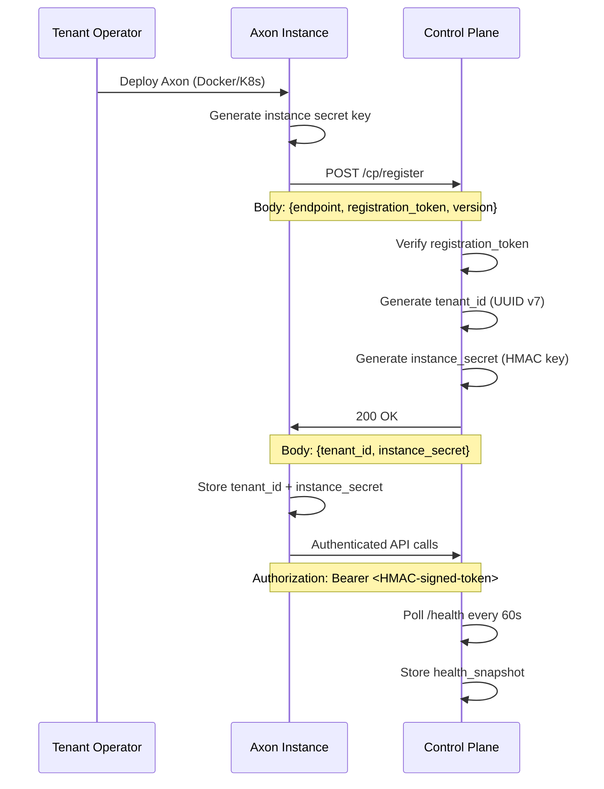

---
ddx:
  id: ADR-017
  depends_on:
    - helix.prd
    - ADR-003
    - ADR-011
---
# ADR-017: Control Plane Topology and BYOC Deployment Model

| Date | Status | Deciders | Related | Confidence |
|------|--------|----------|---------|------------|
| 2026-04-13 | Accepted | Erik LaBianca | FEAT-025, ADR-003, ADR-011 | High |

## Context

Axon's commercial model is **BYOC** (Bring Your Own Cloud): customers run Axon instances in their own infrastructure. As customers scale to multiple tenants and instances, they need a centralized management plane for:

- **Tenant lifecycle management**: provisioning, deprovisioning, configuration
- **Monitoring**: health checks, capacity tracking, aggregate dashboards
- **Operational visibility**: single pane of glass across all instances

The control plane must operate without touching tenant data — all monitoring is metadata-only (health, configuration, capacity).

| Aspect | Description |
|--------|-------------|
| Problem | No centralized management for multi-instance deployments. Operators must manually track and monitor each Axon instance |
| Current State | Each Axon instance runs independently. Multi-tenant deployments require manual orchestration |
| Requirements | One PostgreSQL-backed control plane managing multiple tenant instances. BYOC deployments. Data sovereignty guarantee. |

## Decision

### 1. Architecture Overview

```
┌─────────────────────────────────────────────────────────────────────┐
│                      Control Plane (CP)                             │
│  ┌───────────────────────────────────────────────────────────────┐  │
│  │  PostgreSQL DB (CP metadata only)                             │  │
│  │  - tenant_registry: {tenant_id, endpoint, config, version}   │  │
│  │  - health_snapshots: {tenant_id, timestamp, status, metrics} │  │
│  │  - tenant_config: {tenant_id, schema_version, rate_limits}   │  │
│  └───────────────────────────────────────────────────────────────┘  │
│                              │                                       │
│                              │ authenticated API calls               │
│                              │ (HMAC-signed tokens or mTLS)          │
└──────────────────────────────┼──────────────────────────────────────┘
                               │
        ───────────────────────┼──────────────────────
        │                      │                      │
        ▼                      ▼                      ▼
   ┌─────────┐            ┌─────────┐            ┌─────────┐
   │ Tenant  │            │ Tenant  │            │ Tenant  │
   │ Instance│            │ Instance│            │ Instance│
   │  Axon   │            │  Axon   │            │  Axon   │
   │  (customer│          │  (customer│          │  (customer│
   │   cloud) │          │   cloud) │          │   cloud) │
   └─────────┘            └─────────┘            └─────────┘
```

**Key principle**: The control plane **never** reads or stores tenant entity data. All monitoring is metrics-only via `/health` and `/metrics` endpoints.

### 2. Control Plane Backing Store

**PostgreSQL** is the control plane's backing store, used **exclusively** for CP metadata:

| Table | Purpose | Data Type |
|-------|---------|-----------|
| `tenant_registry` | Tenant instance metadata | Endpoint URL, registration token hash, status, version |
| `health_snapshots` | Health check history | Timestamp, status (healthy/unhealthy), latency, capacity metrics |
| `tenant_config` | Per-tenant configuration | Schema version, rate limits, guardrails, feature flags |
| `node_registry` | Node topology (FEAT-014) | Region, zone, endpoint, status |

**Important**: This database is **completely separate** from any tenant's Axon backing store. No entity data ever touches the CP DB.

#### Schema

```sql
-- Tenant registry (one row per managed tenant instance)
CREATE TABLE tenant_registry (
    tenant_id         UUID PRIMARY KEY,  -- Axon tenant ID (FEAT-014)
    endpoint          TEXT NOT NULL,     -- Instance URL for API calls
    registration_token TEXT NOT NULL,    -- HMAC signature (hashed)
    status            TEXT NOT NULL,     -- 'active', 'deactivated', 'error'
    version           TEXT NOT NULL,     -- Axon server version
    created_at        TIMESTAMPTZ NOT NULL,
    updated_at        TIMESTAMPTZ NOT NULL,
    metadata          JSONB              -- Arbitrary config
);

-- Health snapshots (time-series data)
CREATE TABLE health_snapshots (
    id                BIGSERIAL PRIMARY KEY,
    tenant_id         UUID NOT NULL REFERENCES tenant_registry(tenant_id),
    timestamp         TIMESTAMPTZ NOT NULL DEFAULT NOW(),
    status            TEXT NOT NULL,     -- 'healthy', 'unhealthy', 'unknown'
    latency_ms        DOUBLE PRECISION,  -- /health endpoint latency
    storage_gb_used   DOUBLE PRECISION,  -- From /metrics
    storage_gb_total  DOUBLE PRECISION,  -- From /metrics
    connections       INTEGER,           -- From /metrics
    error_rate        DOUBLE PRECISION,  -- From /metrics
    INDEX idx_health_tenant_time (tenant_id, timestamp DESC)
);

-- Per-tenant configuration (override defaults)
CREATE TABLE tenant_config (
    tenant_id         UUID PRIMARY KEY REFERENCES tenant_registry(tenant_id),
    schema_version    BIGINT NOT NULL DEFAULT 1,
    rate_limits       JSONB,             -- Per-agent rate limits
    guardrails        JSONB,             -- Scope constraints, etc.
    feature_flags     JSONB,             -- Enable/disable features
    created_at        TIMESTAMPTZ NOT NULL,
    updated_at        TIMESTAMPTZ NOT NULL
);

-- Node topology (FEAT-014 integration)
CREATE TABLE node_registry (
    node_id           SERIAL PRIMARY KEY,
    name              TEXT NOT NULL UNIQUE,
    region            TEXT NOT NULL,
    zone              TEXT,
    endpoint          TEXT NOT NULL,
    status            TEXT NOT NULL DEFAULT 'active',
    capabilities      JSONB,
    last_heartbeat    TIMESTAMPTZ NOT NULL DEFAULT NOW()
);

CREATE TABLE database_placement (
    database_id       UUID NOT NULL,
    node_id           INT NOT NULL REFERENCES node_registry(node_id),
    role              TEXT NOT NULL DEFAULT 'primary',
    assigned_at       TIMESTAMPTZ NOT NULL,
    PRIMARY KEY (database_id, node_id)
);
```

### 3. CP-to-Instance Authentication

Each managed Axon instance exposes:
- `/health` — health check (public endpoint, returns status)
- `/metrics` — Prometheus-format metrics (public endpoint)
- `/api/v1/*` — Axon API (authenticated)

**Decision**: Use **HMAC-signed tokens** for CP-to-instance authentication.

#### Why HMAC over mTLS

| Aspect | HMAC Token | mTLS |
|--------|-----------|------|
| Operational complexity | Low (config file) | High (cert management, rotation) |
| Container-friendly | Yes (environment variables) | No (volume mounts, secrets) |
| Revocation | Immediate (token rotation) | Delayed (CRL, OCSP) |
| Debugging | Easy (curl -H "Authorization: Bearer ...") | Complex (openssl s_client) |
| Performance | ~0.1ms overhead | ~0.5ms handshake |

**Trade-off**: HMAC requires secure token distribution (solved by registration flow). mTLS is stronger authentication but operationally heavy for V1.

#### Token Format

```json
{
  "iss": "control-plane",
  "tenant_id": "uuid",
  "iat": timestamp,
  "exp": timestamp + 1h,
  "signature": "HMAC-SHA256(secret, header.payload)"
}
```

**Header**: `Authorization: Bearer <signed_token>`

**Implementation**:
```rust
// CP generates token
let token = cp_auth::generate_token(tenant_id, secret_key);

// Instance validates token
let claims = instance_auth::validate_token(&bearer_token, secret_key)?;
```

#### Token Distribution

1. **Registration**: Instance posts to `/cp/register` with:
   - Instance endpoint URL
   - Registration token (pre-shared secret)
   - Axon version

2. **CP verifies**:
   - Registration token matches expected value
   - Endpoint is reachable
   - Version is supported

3. **CP responds** with:
   - Instance ID (tenant_id)
   - Instance-specific secret key (HMAC signing key)
   - Token format documentation

4. **Instance stores** the secret key in its config and uses it for:
   - Validating CP requests
   - Generating tokens for CP-to-instance auth

### 4. Tenant Registration Flow (BYOC)



**Registration endpoint**:
```
POST /cp/register

Request:
{
  "endpoint": "https://axon-tenant-1.example.com",
  "registration_token": "pre-shared-secret-from-customer",
  "version": "0.3.0"
}

Response (201 Created):
{
  "tenant_id": "c1a2b3d4-5e6f-7g8h-9i0j-k1l2m3n4o5p6",
  "instance_secret": "xYz123AbCdEfGhIjKlMnOpQrStUvWxYz",
  "health_poll_interval_seconds": 60,
  "registration_timestamp": "2026-04-13T20:30:00Z"
}
```

### 5. Health Monitoring

The CP polls each registered instance's `/health` endpoint at a configurable interval:

```
Health polling interval: 60 seconds (configurable)
Timeout: 5 seconds
Retries: 3 with exponential backoff
```

**Health endpoint** (instance-side):
```
GET /health

Response (200 OK):
{
  "status": "healthy",
  "version": "0.3.0",
  "backing_store": "postgresql",
  "timestamp": "2026-04-13T20:31:00Z"
}
```

**Health snapshot** (stored in CP DB):
```sql
INSERT INTO health_snapshots (tenant_id, status, latency_ms, timestamp)
VALUES (:tenant_id, 'healthy', 42.3, NOW());
```

**Aggregate dashboard query**:
```sql
SELECT 
    tr.tenant_id,
    tr.endpoint,
    hs.status,
    hs.latency_ms,
    hs.storage_gb_used,
    hs.storage_gb_total,
    hs.connections,
    hs.error_rate,
    hs.timestamp
FROM tenant_registry tr
JOIN LATERAL (
    SELECT * FROM health_snapshots hs
    WHERE hs.tenant_id = tr.tenant_id
    ORDER BY hs.timestamp DESC
    LIMIT 1
) hs ON true
WHERE tr.status = 'active'
ORDER BY hs.timestamp DESC;
```

### 6. Tenant Lifecycle

The control plane manages tenant **metadata**, not deployment:

| Action | CP responsibility | Deployment responsibility |
|--------|------------------|--------------------------|
| **Provision** | Record tenant in `tenant_registry` with config | Deploy Axon instance (Docker/K8s manifests) |
| **Configure** | Update `tenant_config` with schema/rate limits | Instance reads config on startup/reload |
| **Deprovision** | Mark tenant as `deactivated` in registry | Instance detects deactivation and shuts down gracefully |
| **Migrate** | Update `node_registry` + `database_placement` | Move database between nodes (see ADR-011) |

**Provisioning API**:
```
POST /cp/tenants

Request:
{
  "tenant_id": "uuid",  // Optional, auto-generated if omitted
  "endpoint": "https://axon-tenant.example.com",
  "region": "us-east-1",
  "zone": "us-east-1a",
  "config": {
    "schema_version": 1,
    "rate_limits": {"requests_per_minute": 1000},
    "feature_flags": {"enable_graphql": true}
  }
}

Response (201 Created):
{
  "tenant_id": "uuid",
  "status": "active",
  "created_at": "2026-04-13T20:30:00Z"
}
```

**Deprovisioning**:
1. CP marks tenant as `deactivated` (soft delete)
2. Tenant data retention policy enforced (e.g., 30 days retention)
3. CP permanently deletes tenant record after retention period
4. Instance may continue serving read traffic during retention (configurable)

### 7. Data Sovereignty Guarantee

**Explicit guarantee**: The control plane **never** reads or stores tenant entity data.

**Data flow**:
```
Tenant Instance (customer cloud)
    │
    ├── Writes → Tenant's Axon backing store (customer DB)
    │
    ├── Reads ← Tenant's Axon backing store (customer DB)
    │
    └── Health/metrics ← CP polling (POST /health, GET /metrics)
            │
            └── CP stores ONLY: timestamp, status, latency, capacity metrics
                NO entity data stored
```

**Implementation constraints**:
1. CP handlers never call tenant Axon API endpoints that read entity data
2. CP database schema has no columns for entity data
3. Audit log entries from tenant instances are not forwarded to CP
4. Metrics endpoints expose only aggregate statistics (no entity-level data)

### 8. BYOC Air-Gap Mode

**Local CP mode**: The control plane can run entirely within customer infrastructure with no external dependencies.

**Use case**: Customer runs Axon instances in an air-gapped environment (no internet access). CP must operate without external dependencies.

**Local CP configuration**:
```toml
[control_plane]
mode = "local"  # or "managed" (default)
# No external dependencies required

[control_plane.database]
url = "postgresql://localhost/axon_cp"

[control_plane.health_poll]
enabled = true
interval_seconds = 60

[control_plane.metrics]
# Local metrics (Prometheus) only, no external exporters
enabled = true
port = 9090
```

**Local mode characteristics**:
- All data stays within customer infrastructure
- No external API calls (CP to tenant instances only, both in customer cloud)
- No cloud provider dependencies (AWS/GCP/Azure)
- No external logging or monitoring (customer's existing tools)

### 9. Implementation Plan

#### Crate Structure

```
crates/
  axon-control-plane/
    src/
      lib.rs              # Core types, traits
      api/                # CP HTTP/gRPC API handlers
        register.rs       # POST /cp/register
        tenants.rs        # GET/POST/PUT/DELETE /cp/tenants
        health.rs         # GET /cp/health (CP's own health)
      registry/           # Tenant registry DB access
        mod.rs
        postgres.rs       # PostgreSQL implementation
      health_poller.rs    # Background task polling instance /health
      metrics/            # Metrics collection
        mod.rs
        prometheus.rs     # Prometheus exporter
    tests/
      integration.rs      # End-to-end tests
```

#### Dependencies

| Crate | Version | Purpose |
|-------|---------|---------|
| `postgres` | 0.19 | CP backing store (synchronous) |
| `tokio` | 1.x | Async runtime |
| `axum` | 0.7 | HTTP server (CP API) |
| `tonic` | 0.11 | gRPC API (optional) |
| `hmac` | 0.12 | HMAC token signing/verification |
| `sha2` | 0.10 | SHA-256 for HMAC |
| `prometheus` | 0.13 | Metrics export |
| `serde` | 1.x | Serialization |

#### Initial Scope (V1)

1. **Tenant registry**: PostgreSQL-backed CRUD operations
2. **Registration flow**: Instance registration with HMAC token distribution
3. **Health polling**: Background task polling `/health` endpoints
4. **Health storage**: Time-series storage in `health_snapshots`
5. **Basic dashboard query**: Latest health per tenant
6. **Local mode**: No external dependencies (all within customer cloud)

**Deferred (P2)**:
- gRPC API (HTTP only for V1)
- Tenant deprovisioning with data retention policy
- Multi-region CP (replication between CP instances)
- Alerting (Slack/email notifications)
- Grafana dashboard templates

### 10. API Surface

#### Tenant Management

| Method | Path | Description |
|--------|------|-------------|
| GET | `/cp/tenants` | List all tenants |
| GET | `/cp/tenants/{tenant_id}` | Get tenant details |
| POST | `/cp/tenants` | Register/provision tenant |
| PUT | `/cp/tenants/{tenant_id}` | Update tenant config |
| DELETE | `/cp/tenants/{tenant_id}` | Deactivate tenant (soft delete) |
| POST | `/cp/tenants/{tenant_id}/deprovision` | Hard delete tenant (after retention) |

#### Health & Metrics

| Method | Path | Description |
|--------|------|-------------|
| GET | `/cp/health` | CP's own health check |
| GET | `/cp/metrics` | CP's own Prometheus metrics |
| GET | `/cp/dashboard/health` | Aggregate health dashboard (latest per tenant) |

#### Instance Registration

| Method | Path | Description |
|--------|------|-------------|
| POST | `/cp/register` | Instance registration (BYOC) |

### 11. Security Considerations

#### Registration Token Security

- Registration tokens must be rotation-friendly (token can be rotated on each instance)
- Tokens should have a lifetime (e.g., 24 hours) after which registration fails
- CP should log registration attempts (successful and failed) for audit

#### HMAC Key Security

- Instance secrets are stored hashed in CP DB (SHA-256)
- Instance secrets are never transmitted over the network (only during registration)
- Instance secrets are rotated periodically (configurable, default 90 days)

#### Network Security

- CP-to-instance connections use HTTPS (TLS 1.3)
- Instance should validate CP's TLS certificate (chain of trust)
- Internal deployments can use self-signed certificates with config option

### 12. Consequences

**Positive**:
- CP never touches tenant data — strong data sovereignty guarantee
- PostgreSQL is well-understood, HA patterns exist (streaming replication, etcd)
- HMAC is simpler to operate than mTLS for containerized deployments
- BYOC local mode allows air-gapped deployments
- Single pane of glass for monitoring 100+ tenant instances
- Tenant lifecycle management is metadata-only — no data access required

**Negative**:
- CP is a single point of failure for tenant lifecycle operations (but not for tenant data access)
- Instance registration flow requires pre-shared secret (operator setup step)
- Health polling adds network traffic (60 queries/tenant/minute)
- CP must be deployed separately from tenant instances

**Risks**:
| Risk | Mitigation |
|------|-----------|
| CP becomes unavailable, cannot provision new tenants | Tenant instances continue serving data. CP is out-of-band. |
| Instance secret compromised, CP impersonation | Secret rotation, token expiration, IP-based whitelisting |
| CP DB compromised, tenant metadata exposed | Encryption at rest, network isolation, least-privilege DB roles |
| Health poller overloaded, slow response | Horizontal scaling (multiple CP instances), circuit breakers |

**V1 Scope**:
- Single CP instance (no replication)
- HTTP API only (no gRPC)
- Registration with pre-shared secret
- Health polling (no proactive alerts)
- Local mode (no external dependencies)

### 13. Validation

| Criterion | Test |
|-----------|------|
| CP can register new tenant instance | Integration test: POST `/cp/register` |
| Instance secret is distributed securely | Verify HMAC token validation works |
| Health polling captures status | Query `health_snapshots` table |
| Tenant data is never in CP DB | Schema inspection, audit of CP queries |
| BYOC local mode has no external deps | CI test: deploy CP in isolated network |
| CP-to-instance auth uses HMAC tokens | Test: malformed token rejected |
| Dashboard query works | Health check endpoint returns latest per tenant |

### 14. References

- [ADR-003: Backing Store Architecture](ADR-003-backing-store-architecture.md)
- [ADR-011: Multi-Tenancy and Namespace Hierarchy](ADR-011-multi-tenancy-and-namespace-hierarchy.md)
- [FEAT-012: Authorization](../../01-frame/features/FEAT-012-authorization.md)
- [FEAT-014: Multi-Tenancy](../../01-frame/features/FEAT-014-multi-tenancy.md)
- [FEAT-025: Control Plane](../../01-frame/features/FEAT-025-control-plane.md)
- [PRD §8 P1 #18: Control Plane](../../01-frame/prd.md#control-plane-p2)
