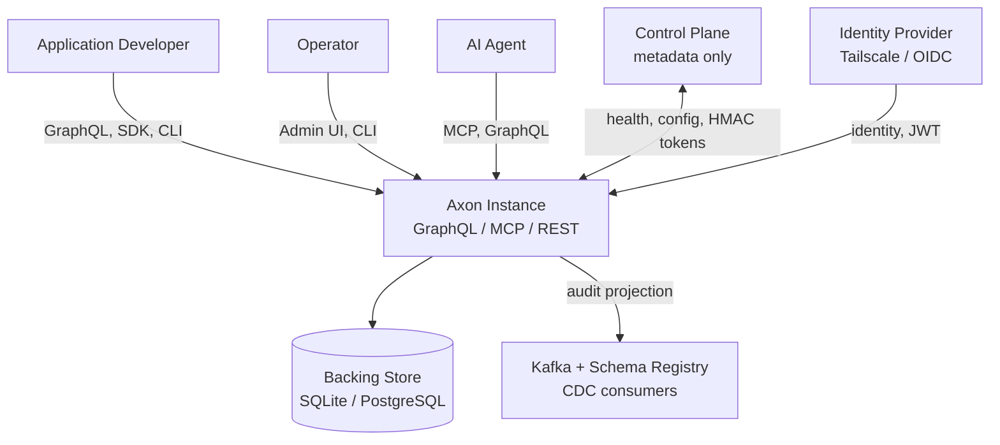
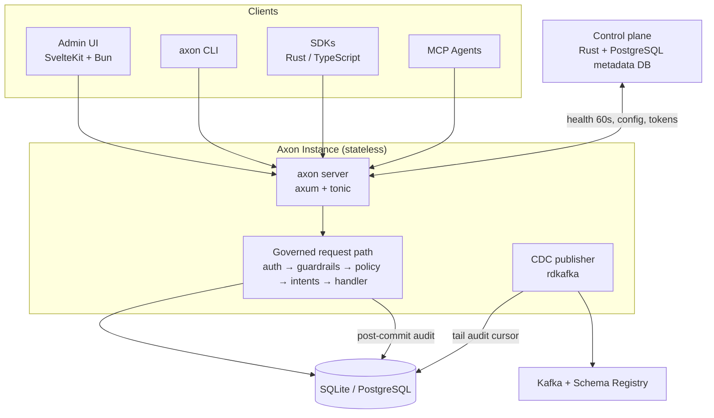
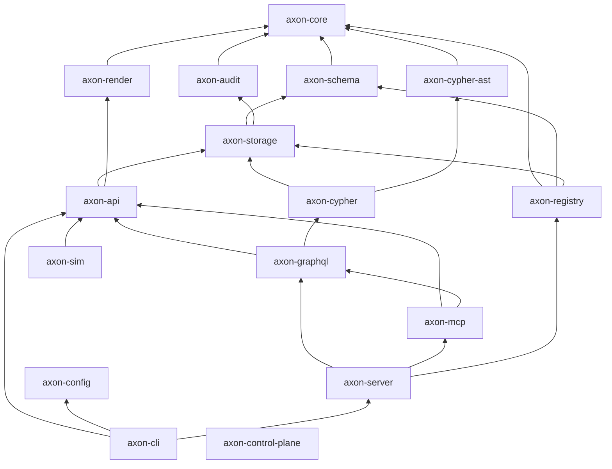
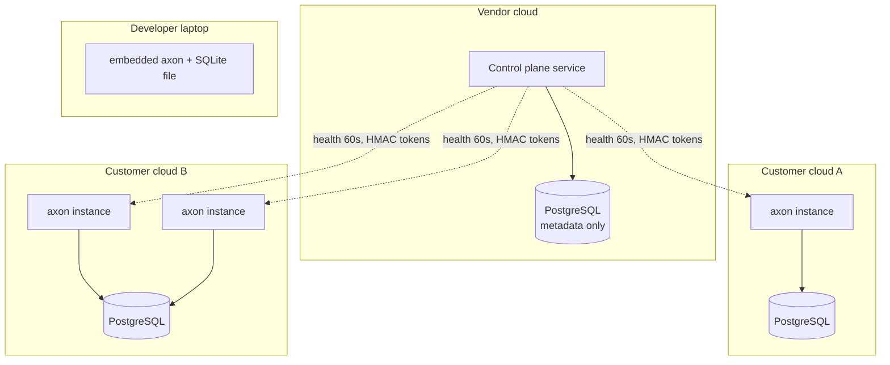
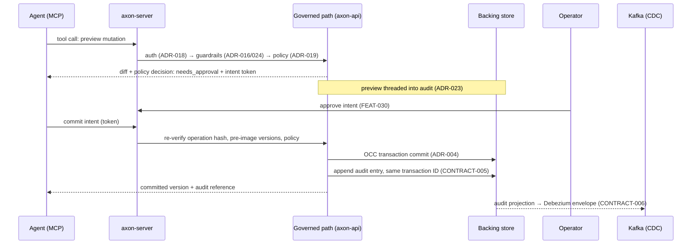

---
ddx:
  id: helix.architecture
  depends_on:
    - helix.prd
    - ADR-003
    - ADR-004
    - ADR-010
    - ADR-011
    - ADR-014
    - ADR-016
    - ADR-017
    - ADR-018
    - ADR-019
    - ADR-020
    - ADR-021
  review:
    # TODO: refresh review stamp (read-side subsection + local-replica consumer added, 2026-06-27)
    self_hash: 31ea2c1044ec737c0030658c1f48b5da1fb0e159e18eb4f90dd86a64fdb94735
    deps:
      ADR-003: 10f82ff7aa93119d55bed2201b864cd3d78364691948228a7ae04c6a1b370885
      ADR-004: de71b28d07985455c869a2157afbc61158b726134c81f5d13caa5f5f341cedd1
      ADR-010: 80dcbb947056ff9555019c8cbc3c3a6e9dbe67cdaa668402b15d7bbc5d905930
      ADR-011: 128732e07720a3aee6e4d88295cae04893d5c661d8744246532cccb1e667ea58
      ADR-014: 6b9f2190081dd7dae202942b25247ee638b0359a4ead7109987b5bc4440c7347
      ADR-016: d023701c0bedc5ada8a9121fa850a6b78d7b2b2f39d2b7ac41d7d2c48de7a1b9
      ADR-017: f728a498d6498055fa260edf63ca07dee16c4101800198e8b5b59427fe29c045
      ADR-018: 6282a6ac66a0dcfd400663681132c9f5f85ed7c78793a1cf7f8bf06853cf1d97
      ADR-019: 3ec156d9ec6696d67e0f12a6c80495c9166470525128ac475b95dae0b5647f7e
      ADR-020: ed351273fc7b4c46f5114aa6f0e1e942ae3fcd2e7ca74ad989b23ea730d23790
      ADR-021: 7672758c3841fb3871bc2b8f90aeb7c63d5453c42dae5bedf5cf27d6394dda78
      helix.prd: 6703170c71275bba7d108c4f9c329d32e4104f9c965278db888ad43cdc3ca367
    reviewed_at: "2026-07-11T02:44:22Z"
---

# Architecture

**System**: Axon — cloud-native, auditable, schema-first transactional data
store for agentic applications
**Date**: 2026-06-10
**Status**: Accepted (describes the desired system shape; binding decisions
live in the ADRs and contracts referenced throughout)

## Scope

This document is the structural map of Axon: system boundaries, the governed
request path, crate decomposition, data architecture, deployment shapes, and
the quality attributes that constrain the design. It covers the Axon data
plane (server, embedded library, query surfaces), the audit/CDC pipeline,
and the BYOC control plane.

Deliberately outside the boundary: backing-store internals (replication,
consensus, crash recovery are delegated — see ADR-003), customer application
code, and the Kafka/Schema Registry infrastructure that CDC targets.

Driving inputs: the [Product Vision](../00-discover/product-vision.md), the
[PRD](../01-frame/prd.md), the [Principles](../01-frame/principles.md), and
the feature specs in [`01-frame/features/`](../01-frame/features/). This
document points at ADRs and contracts rather than restating them; where a
detail matters, the cited artifact is normative.

## Level 1: System Context

Axon sits between agentic applications and a conventional backing store,
adding the layers agents need and databases lack: schema validation, policy,
mutation intents, immutable audit, and change feeds.

| Element | Type | Purpose | Protocol |
|---------|------|---------|----------|
| Application developer | User | Defines ESF schemas and policy, integrates SDKs | GraphQL, SDK (Rust/TypeScript), CLI |
| Operator | User | Administers tenants, approves intents, inspects audit | Admin UI (SvelteKit), CLI, GraphQL |
| AI agent | User | Reads/writes entities under guardrails and policy | MCP, GraphQL |
| Axon | System | Governed, auditable entity-graph store | HTTP path-scheme `/tenants/{t}/databases/{d}/...` (ADR-018) |
| Backing store | External | Durability, replication, crash recovery | SQLite (embedded) / PostgreSQL (server) per ADR-003 |
| Kafka + Schema Registry | External | CDC consumers (Debezium-compatible envelopes) | Kafka wire protocol (ADR-014) |
| Control plane | System (separate) | Fleet metadata, health, tenant config — never entity data | HTTPS + HMAC-signed tokens (ADR-017/018) |
| Identity provider | External | User federation (Tailscale today, OIDC later) | Tailscale LocalAPI (ADR-005), JWT issuance (ADR-018) |

## The Governed Request Path

The spine of the architecture is a single shared handler path that every
mutation traverses, in fixed order. Each stage cites its governing artifact;
this document does not redefine any stage.

| # | Stage | What it does | Governing artifacts |
|---|-------|--------------|---------------------|
| 1 | Authentication & tenancy | Verify JWT (signature, expiry, revocation, `aud` = URL tenant), resolve `(user, tenant, database)` from the path, check membership, grants, and tenant `auth_epoch` freshness | ADR-018, FEAT-012 |
| 2 | Guardrails | Per-actor sliding-window rate limits and entity-filter scope constraints, in-process, <1 ms overhead; rejections are audited | ADR-016 (architecture), ADR-024 (algorithm), FEAT-022 |
| 3 | Policy | Adapter-owned `policy_catalog` row for the target `(tenant_id, database_id)` pair, carrying `auth_scope_required`, `policy_epoch`, `policy_hash`, and the compiled ESF `access_control` plan; missing rows fail closed | ADR-019, CONTRACT-004, FEAT-029 |
| 4 | Intent routing | Approval-routed writes become mutation intents: preview → approval → commit, with operation-hash and pre-image staleness checks; previews thread into audit | FEAT-030, ADR-019, ADR-023 |
| 5 | Handler | `axon-api`: ESF schema validation, OCC version checks, transaction assembly | ADR-004, CONTRACT-010, FEAT-008 |
| 6 | Storage | `StorageAdapter` commit against SQLite or PostgreSQL; numeric collection IDs, opaque entity blobs, EAV indexes, links table | ADR-003, ADR-010 |
| 7 | Audit | Application-layer, post-commit, append-only audit entry sharing the transaction ID; no orphans on rollback | FEAT-003, CONTRACT-005, ADR-003 |
| 8 | CDC projection | Audit log projected to Debezium-compatible envelopes on Kafka topics, `audit_id` as replay offset | ADR-014, CONTRACT-006, FEAT-021 |

**Non-bypass invariant.** Every surface — GraphQL, MCP, REST, CLI, SDK, the
admin UI, and the embedded in-process API — is a view over this one path. No
surface bypasses any stage; parity is verified by shared fixtures. When a
feature appears to need a bypass, the handler path changes instead. This is
Principle 1, "Guardrails Are the Product"
([principles.md](../01-frame/principles.md)).

Reads traverse stages 1–3 and 5–6 (policy applies row filtering at match,
field redaction at projection — ADR-019, ADR-021) and are not audited as
mutations; query surfaces are governed by CONTRACT-002/003/007.

### The Two Read Sides

Axon has two complementary read sides, both governed by the same policy and
redaction stages above:

- **Live-state read models** — queries against current committed state through
  the handler path: the unified graph query (FEAT-009), secondary indexes
  (FEAT-013), the GraphQL query layer (FEAT-015), and aggregation (FEAT-018).
  These answer "what is true now" and apply row filtering and field redaction
  at query time.
- **Event-derived projection** — the audit log projected to a change stream:
  CDC (FEAT-021/ADR-014) and GraphQL subscriptions (FEAT-015), sharing one
  durable cursor vocabulary (CONTRACT-006 §Cursor semantics). These answer
  "what changed, in order, resumably."

The **client local read replica** (FEAT-032, FR-32) is a *consumer* of the
event-derived projection: the SDK's `LocalReplica` and the storage-backed
`StorageCursorStore` already exist, and the server snapshot bootstrap path
already emits `op: "r"` bootstrap events. The replica boots from a snapshot and
tails the change stream using the same opaque, restart/schema-stable cursor
vocabulary (ADR-025), maintaining a client-resident read model for responsive
search/sort/filter without server round-trips. Redaction is applied at
projection time so the replica never holds data the subject may not see
(ADR-019). The boundary is still partial/unwired end-to-end: GraphQL
subscriptions continue to expose raw `audit_id` reconnects, and the single
opaque cursor vocabulary has not yet replaced every consumer. Replica
writeback remains out of scope (FR-33, deferred).

## Level 2: Container Diagram

| Container | Technology | Responsibilities | Communication |
|-----------|------------|------------------|---------------|
| Axon server | Rust, axum + tonic (single `axon` binary, FEAT-028) | Hosts the governed request path; serves GraphQL, MCP, REST, gRPC; stateless — any instance serves any request | HTTP/1.1+2, JSON / GraphQL / MCP, path-based routing (ADR-018) |
| Embedded Axon | Rust library (same crates, no server) | Same handler path in-process for dev/test/edge | Native Rust traits |
| Backing store | SQLite/libSQL (embedded) or PostgreSQL 16 (server, 0.4.x pilot qualification only) | Durable storage of entities, links, EAV indexes, audit, schemas; replication and failover | SQL over `rusqlite` / `tokio-postgres` (ADR-003) |
| CDC publisher | `rdkafka` producer inside the server | Tails audit log by cursor, emits Debezium envelopes, at-least-once | Kafka protocol; Confluent Schema Registry façade (ADR-014) |
| Control plane | Rust (`axon-control-plane`) + PostgreSQL metadata DB | Tenant registry, health snapshots (60 s polling), tenant config, node registry / database placement; never reads entity data | HTTPS, HMAC-signed registration and instance tokens (ADR-017/018) |
| Admin UI | SvelteKit + Bun + Vite (ADR-006) | Operator console: schemas, policy, intents, audit, tenants | GraphQL against the Axon server |
| CLI | `axon` binary (CONTRACT-008) | Embedded and remote workflows: preview/commit, policy explain, audit query, rollback dry-run | In-process or HTTP |

## Level 3: Component Diagram — Crate Decomposition

The workspace is 16 Rust crates. The decomposition mirrors the request path:
surfaces depend on `axon-api`, which depends on schema/storage/audit, which
depend only on `axon-core`.

| Crate | Purpose | Notes |
|-------|---------|-------|
| `axon-core` | Core types, traits, `AxonError` hierarchy | Root of the graph; no internal deps |
| `axon-schema` | ESF parsing, `CollectionSchema`, validation, index definitions | CONTRACT-010 |
| `axon-audit` | Append-only audit log types and writer | CONTRACT-005; no schema dep |
| `axon-storage` | `StorageAdapter` trait + SQLite/PostgreSQL/in-memory backends | ADR-003/010 |
| `axon-api` | The shared handler path: transactions, OCC, policy and intent orchestration | Every surface routes here |
| `axon-cypher-ast` | Cypher AST as a standalone crate | Lets `axon-schema` declare named queries without depending on the executor |
| `axon-cypher` | Cypher parser, rules-based planner, streaming executor | ADR-021, CONTRACT-007 |
| `axon-graphql` | GraphQL schema generation from ESF, resolvers, subscriptions | ADR-012, CONTRACT-002 |
| `axon-mcp` | MCP server; tools/resources generated from ESF | ADR-013, CONTRACT-003 |
| `axon-registry` | Confluent-compatible schema-registry REST facade | FEAT-021, CONTRACT-006; depends on core/schema/storage |
| `axon-server` | HTTP/gRPC entrypoint, middleware (auth, guardrails), routing | axum + tonic |
| `axon-render` | Mustache markdown template validation and rendering | FEAT-026; **deliberately no `axon-schema` dependency** — receives schemas as `serde_json::Value` to avoid a dependency cycle |
| `axon-config` | XDG path resolution, TOML config loading | CONTRACT-008; no internal deps |
| `axon-control-plane` | Tenant registry, health polling, fleet metadata | **Zero internal `axon-*` dependencies** — enforces the data-sovereignty boundary in the dependency graph itself (ADR-017) |
| `axon-sim` | Deterministic simulation testing harness: BUGGIFY fault injection, ring-integrity cycle tests, invariant verification | FoundationDB-style DST; depends on api/storage/schema/audit |
| `axon-cli` | `axon` binary; embedded and remote modes | Pulls in `axon-server` behind a feature flag |

Dependency sketch (arrows point at dependencies):

`axon-config` and `axon-control-plane` are intentionally disconnected from
the internal graph.

## Data Architecture

Full detail in ADR-010 (physical layout), ADR-011/018 (hierarchy and
addressing), ADR-020 (data model), CONTRACT-010 (ESF).

- **Four-level hierarchy**: tenant (global account boundary — owns users,
  credentials, databases) > database > schema > collection > entities.
  Nodes are physical placement only, invisible from the data path; a
  `database_placement` table maps `(tenant, database)` to nodes, so database
  migration is a routing-table update, not a key-space rewrite (ADR-011).
- **Addressing**: every entity has a canonical, dereferenceable URL
  `/tenants/{t}/databases/{d}/entities/{collection}/{id}` — simultaneously
  identifier, routing key, and cache key; JSON-LD on request (ADR-018/020).
- **Entity storage**: document-shaped entities (not native RDF, ADR-020)
  stored as opaque blobs (JSONB on PostgreSQL, TEXT on SQLite); numeric
  collection IDs; UUIDv7 entity IDs (ADR-010).
- **Policy catalog**: one adapter-owned `policy_catalog` row per
  `(tenant_id, database_id)` pair carries the normalized policy AST and
  `AXON-POLICY-HASH-1`; it is not an entity collection, and missing rows
  fail closed.
- **EAV secondary indexes**: per-type `index_{string,integer,float,datetime,boolean}`
  tables keyed `(collection_id, field_path, value, entity_id)`, plus
  compound indexes with binary tuple-encoded sort keys and unique indexes.
  All structured queries go through declared indexes; no backend-specific
  operators (ADR-010, FEAT-013).
- **Links table**: dedicated table with DB-enforced referential integrity
  (`ON DELETE RESTRICT` on both endpoints) and reverse-lookup index;
  link metadata capped at 64 KB (ADR-010).
- **Audit log**: append-only, partitioned monthly by time range, indexed on
  `(collection_id, entity_id, id)`; `audit_id` doubles as the CDC replay
  offset (ADR-003/014, CONTRACT-005).
- **Physical tenant isolation**: each tenant's data lives in its own
  storage; per-database isolation via column on all backends or PostgreSQL
  schema materialization; the control plane never touches entity data
  (ADR-011/017/018).

## Deployment

Three shapes, smallest to largest. All three run the identical governed
request path and pass the identical correctness suite.

| Component | Infrastructure | Instances | Scaling | Backup / Recovery |
|-----------|----------------|-----------|---------|-------------------|
| Embedded Axon | In-process library + SQLite file; zero external dependencies | 1 per host process | N/A (single process) | Single-file database copy/restore |
| Single-binary server (FEAT-028) | `axon` binary + PostgreSQL backing store; container or VM | N stateless instances behind a load balancer | Horizontal — add instances; throughput scales with the backing store | PostgreSQL backup/restore (pg_dump / PITR); documented procedure per operational acceptance criteria |
| BYOC fleet (ADR-017 as amended by ADR-018) | Customer-cloud Axon instances + vendor-hosted control plane (Rust service + PostgreSQL metadata DB) | 1+ instance per tenant, multi-node placement via `database_placement` | Per-tenant instance scaling; database migration via placement-table update + data replication | Entity data: customer-side backing-store backups. CP metadata: PostgreSQL backup; CP outage does not interrupt the data plane |

Control-plane mechanics (ADR-017/018): instances register with pre-shared
registration tokens; ongoing CP-to-instance auth uses HMAC-signed (HS256)
tokens; the CP polls `/health` and `/metrics` every 60 s (5 s timeout,
3 retries with backoff) and stores time-series snapshots. The CP holds
`tenant_registry`, `health_snapshots`, `tenant_config`, `node_registry`,
and `database_placement` — metadata only, never entity data.

## Data Flow

The most important flow is an approval-routed agent write — the journey the
product exists to make safe, and the one most likely to fail.

Any staleness — schema version, policy version, pre-image version, grant
version, or operation hash mismatch — fails the commit with no partial data
change (ADR-019, FEAT-030).

## Quality Attributes

Performance and operational targets carried forward from the retired
technical-requirements umbrella; verification methods are binding.

| Attribute | Target | Strategy | Verification |
|-----------|--------|----------|--------------|
| Write latency | <10 ms p99 single-entity write (schema validation + audit); sub-5 ms SQLite, <10 ms PostgreSQL with audit (ADR-003) | Application-layer post-commit audit, no storage triggers; opaque entity blobs | Benchmark suite; p99 must not regress (HELIX ratchet) |
| Read latency | <5 ms p99 point read; <100 ms collection scan (1 000 entities); <50 ms 3-hop traversal; <500 ms aggregation over 10 K entities | EAV index tables with B-tree key locality; links table with reverse index (ADR-010) | Benchmark suite |
| Transactions | <20 ms p99 for 2–5 entity transactions; 100 ops/txn cap; 30 s timeout | OCC version vectors, backend-qualified storage transactions (SQLite `BEGIN IMMEDIATE`, PostgreSQL `SERIALIZABLE`; `REPEATABLE READ` remains implementation work), memory process-lifetime snapshot apply (ADR-004) | DST cycle tests (ring integrity) in `axon-sim` |
| Guardrail overhead | <1 ms per request | In-process sliding-window limiter and entity filters (ADR-016/024) | Microbenchmarks; shared-fixture parity tests |
| Query bounds | Traversal depth ≤10; cardinality budget 1 M rows; 30 s timeout | Streaming Cypher executor with explicit path bounds (ADR-021) | Executor budget tests |
| Availability | Any instance serves any request; horizontal scaling linear with backing store | Stateless servers — no consensus, no leader election; durability delegated (ADR-003) | Operational acceptance: `/health` with store connectivity; graceful SIGTERM drain; connection pooling |
| Correctness | All invariants hold under fault injection: no lost updates, audit completeness/immutability, schema enforcement, link integrity, version monotonicity, transaction atomicity | Deterministic simulation with BUGGIFY (disk/network/clock/crash faults), seed-reproducible | `axon-sim` suite; identical suite passes in embedded and server modes (mode parity) |
| Security | Every request authorized against `(user, tenant, database)`; grants ≤ issuer role ceiling; 401 vs 403 distinction; all rejections audited | JWT credentials with per-tenant `aud` (ADR-018); guardrails (ADR-016/024); policy (ADR-019); non-bypass invariant | Shared-fixture surface-parity tests; threat-model controls (`01-frame/threat-model.md`) |
| Observability | OpenTelemetry traces and metrics for all operations; backing-store capacity metrics | Instrumented middleware in `axon-server` | Operational acceptance criteria |
| Disaster recovery | RPO: 0 for committed transactions on restart-durable backends (durable in backing store at commit; post-commit audit gap closed by startup recovery scan). Memory remains process-lifetime only. RTO: bounded by backing-store restore — embedded: single-file copy; server: PostgreSQL PITR | Durability fully delegated to the backing store; documented backup/restore procedure; transient store failures yield retryable errors, never corruption | Backup/restore drills per operational acceptance criteria; audit-gap count ratchet (toward 0) |

Embedded-mode acceptance: zero external processes, single-file database
(entities, links, audit, schemas), in-process API with the same Rust traits
as server mode, full test-suite parity.

## Decisions and Tradeoffs

All system-shaping decisions are recorded as ADRs; exact shared interface
surface lives exclusively in the contract suite. The
[02-design README](README.md) is the authoritative index.

| Decision | Status | Subject |
|----------|--------|---------|
| ADR-001 | Accepted | Rust as implementation language |
| ADR-002 | Accepted | Schema format: JSON Schema + link-type definitions |
| ADR-003 | Accepted | Backing store: SQLite + PostgreSQL with application-layer audit |
| ADR-004 | Accepted | Transaction model: optimistic concurrency control |
| ADR-005 | Accepted | Authentication via Tailscale LocalAPI |
| ADR-006 | Accepted | Admin UI: SvelteKit + Bun + Vite |
| ADR-007 | Accepted | Schema versioning and link-type validation |
| ADR-008 | Accepted | Lifecycle state machines as schema declarations |
| ADR-009 | Accepted | JSON Merge Patch and optional ID generation |
| ADR-010 | Accepted | Physical storage schema and secondary indexes |
| ADR-011 | Accepted (amended by ADR-018) | Multi-tenancy, namespace hierarchy, node topology |
| ADR-012 | Accepted | GraphQL query layer auto-generated from ESF |
| ADR-013 | Accepted | MCP server (Model Context Protocol) |
| ADR-014 | Accepted | Change feeds: Debezium-compatible CDC with Kafka and Schema Registry |
| ADR-015 | Accepted | Rollback and recovery: compensating transaction semantics |
| ADR-016 | Accepted (rate-limiter algorithm superseded by ADR-024) | Agent guardrails: rate limiting and scope constraints |
| ADR-017 | Accepted (tenant model and route prefix superseded by ADR-018) | Control-plane topology and BYOC deployment model |
| ADR-018 | Accepted | Tenant as global account boundary, M:N users, JWT credentials, path-based wire protocol |
| ADR-019 | Accepted | Policy authoring and mutation intents |
| ADR-020 | Accepted | Data model: document-shaped entities, not native RDF |
| ADR-021 | Accepted | Graph query language: openCypher subset |
| ADR-022 | Accepted | Create semantics: storage upsert, strict create at typed surfaces |
| ADR-023 | Accepted | Preview-record audit threading |
| ADR-024 | Accepted | Rate-limiting semantics: per-actor sliding window |

| Contract | Subject |
|----------|---------|
| CONTRACT-001 | HTTP API surface |
| CONTRACT-002 | GraphQL surface |
| CONTRACT-003 | MCP surface |
| CONTRACT-004 | Policy grammar |
| CONTRACT-005 | Audit record |
| CONTRACT-006 | CDC envelope |
| CONTRACT-007 | Cypher query surface |
| CONTRACT-008 | CLI and config |
| CONTRACT-009 | SDK surface |
| CONTRACT-010 | ESF schema format |

Structural tradeoffs worth naming once:

- **Stateless servers, delegated durability** (ADR-003) — Axon ships no
  consensus protocol; the backing store sets the availability ceiling. Wins
  simplicity and horizontal scaling; the cost is that distributed backends
  (FoundationDB, TiKV) remain adapter work, not core work.
- **Application-layer audit** (ADR-003) — keeps the audit pipeline portable
  across backends at the cost of a narrow post-commit crash window, closed
  by startup recovery scan; the audit-gap ratchet enforces convergence to 0.
- **Document model over native RDF** (ADR-020) — closed-world validation and
  predictable write latency over SPARQL/OWL expressiveness; dereferenceable
  IRIs, JSON-LD, and PROV-O are adopted opportunistically.
- **Control-plane isolation in the dependency graph** (ADR-017) —
  `axon-control-plane` carries zero internal crate dependencies so the
  data-sovereignty promise (CP never reads entity data) is structural, not
  conventional.
